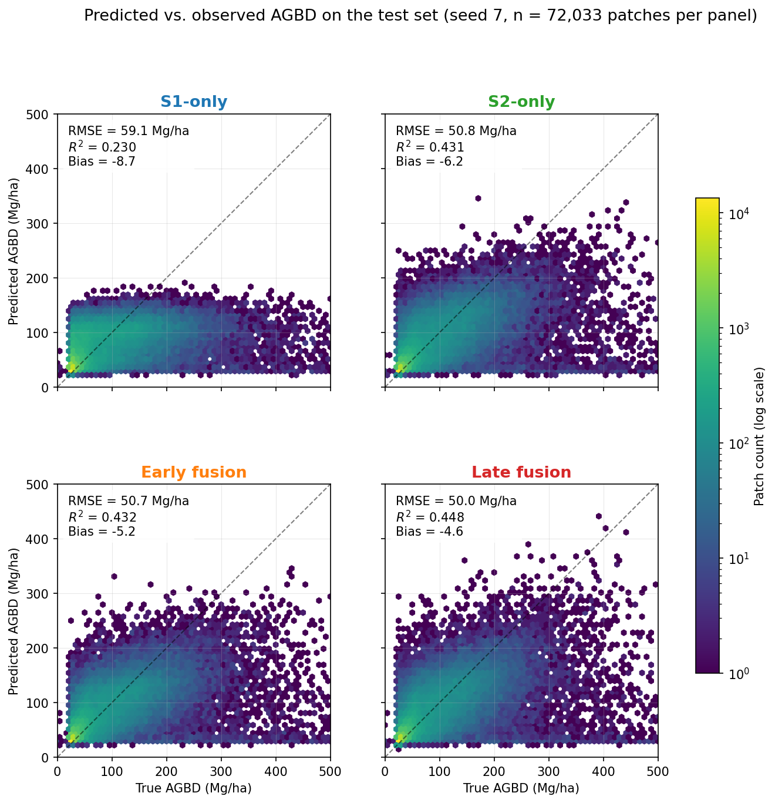
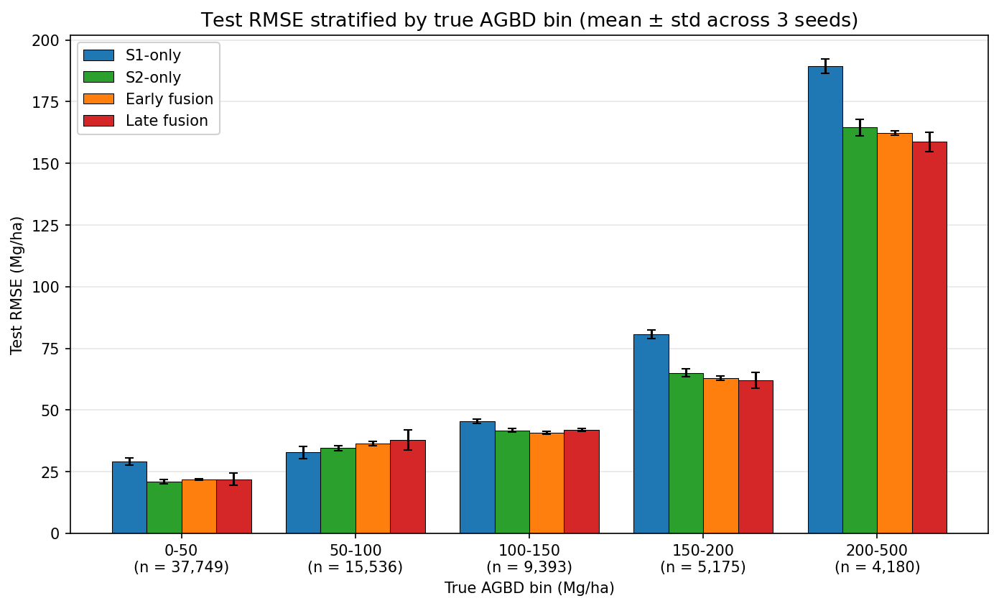

# Early vs. Late Fusion of Sentinel-1 and Sentinel-2 for GEDI-Supervised Biomass Regression

> Sparse-supervised regression for above-ground biomass: GEDI L4A lidar footprints as labels, Sentinel-1 SAR and Sentinel-2 optical imagery as inputs, dense biomass maps as outputs.

A research project by [Chavosh Almassian](https://www.linkedin.com/in/chavosh-almassian-81a05216a/), M.Sc. Remote Sensing and Geoinformatics, Karlsruhe Institute of Technology. Targeting publication in IEEE GRSL / JSTARS as a methodological contribution to GEDI-supervised biomass mapping with multi-sensor fusion. The repository also functions as a portfolio piece for PhD applications aligned with KIT C4LaND-style positions on BIOMASS and NISAR forest monitoring.

**Project status:** Phase 5 in progress: wall-to-wall biomass maps produced at 100 m (late-fusion ensemble mean + per-pixel uncertainty, mean CV 7.6%). External validation against ESA CCI Biomass and Spanish IFN pending.
**Decisions log:** [`docs/decisions.md`](docs/decisions.md), every non-obvious methodological choice is recorded with rationale and alternatives.

---

## Why this project

GEDI (Global Ecosystem Dynamics Investigation) is a NASA spaceborne lidar that measures above-ground biomass density at ~25 m footprints, accurately but sparsely - covering roughly 4% of the land surface within its ±51.6° latitude band. To produce wall-to-wall biomass maps, GEDI's sparse measurements must be combined with dense optical and SAR observations from satellites like Sentinel-2 and Sentinel-1.

The remote-sensing community has converged on this strategy, but the question of *how* to fuse SAR and optical inputs - early fusion (concatenated channels), late fusion (independent encoders combined at decision time), or alternatives - remains open. Existing GEDI biomass papers typically pick one fusion strategy without controlled comparison.

This project provides that controlled comparison over a forested AOI in Northwest Iberia, with strict spatial cross-validation, explicit saturation analysis at high biomass values, and per-pixel uncertainty estimation. The four model variants (S1-only, S2-only, early fusion, late fusion) share a common backbone, training procedure, and patch dataset to isolate the fusion strategy as the only varying factor.

```text
  Sparse supervision                Dense inputs
  ──────────────────                ────────────
  GEDI L4A footprints               Sentinel-1 (VV, VH, LIA)
  (~25 m, sparse points)            Sentinel-2 (10 spectral bands)
                                    Copernicus DEM (elevation, slope)
           │                                    │
           └──────────────┬─────────────────────┘
                          ▼
             ┌────────────────────────────┐
             │  Patch-based regression    │
             │  S1 / S2 / early / late    │
             │       fusion variants      │
             └────────────────────────────┘
                          │
                          ▼
               Wall-to-wall AGBD map
               (Mg/ha, with per-pixel uncertainty)
```

## Study area

Two AOIs are defined in [`configs/aoi/`](configs/aoi/), swappable at the command line via Hydra.

| AOI    | Coverage                                                  | Size            | Purpose              |
|--------|-----------------------------------------------------------|-----------------|----------------------|
| `dev`  | MGRS tile 29TNG, central Galicia                          | ~110 × 110 km   | Pipeline prototyping |
| `full` | Northwest Iberia (lon −9.5° to −5.5°, lat 41.5° to 43.5°) | ~400 × 220 km   | Final paper results  |

Northwest Iberia was chosen for the breadth of its biomass dynamic range (dense Atlantic forest, Mediterranean oak, dehesa savanna), favorable Sentinel-2 cloud climatology relative to central Europe, GEDI shot density at its latitude, and the availability of reference data (Spanish IFN, ESA CCI Biomass). Full rationale in the decisions log.

---

## Phase status

| Phase | Status         | Description                                                          |
|-------|----------------|----------------------------------------------------------------------|
| 0     | ✅ done        | Scoping, AOI selection, project scaffolding, GEDI access validated  |
| 1     | ✅ done        | GEDI L4A acquisition and quality filtering (813,124 shots)          |
| 2     | ✅ done        | Sentinel-1/2 composites, DEM, patch dataset (375,817 patches)       |
| 3     | ✅ done        | Model architecture + training pipeline; 12 reporting runs complete (4 variants × 3 seeds). Late fusion best at val RMSE 45.13 ± 0.23 Mg/ha. |
| 4     | ✅ done        | Test-set evaluation: late fusion best at test RMSE 50.33 ± 0.37 Mg/ha. Stratified analysis by AGBD bin and land cover. |
| 5     | 🚧 in progress | Wall-to-wall maps done (100 m, ensemble mean + uncertainty). CCI/IFN validation pending. |
| 6     | pending        | Manuscript                                                           |

---

## What Phase 2 produced

Concrete artifacts available at AOI scale (dev AOI, ~110 × 110 km, all on a common 10 m UTM 29N grid):

| Artifact                          | Coverage  | Bands / structure                                            | Source                |
|-----------------------------------|-----------|--------------------------------------------------------------|-----------------------|
| GEDI L4A quality-filtered shots   | 813,124   | AGBD + quality fields, 2019-06 to 2022-12                    | NASA ORNL DAAC        |
| Sentinel-2 annual composites      | 2020-2022 | 10 spectral bands, cloud-masked median (SCL)                 | CDSE openEO           |
| Sentinel-1 annual composites      | 2020-2022 | 3 bands: VV (dB), VH (dB), LIA (°), γ⁰ terrain-corrected RTC | ASF Hyp3              |
| Copernicus DEM composite          | static    | 2 bands: elevation (m), slope (°)                            | AWS Open Data         |
| Patch dataset (Zarr)              | 375,817   | 15-channel 25×25 patches, train/val/test, AGBD labels        | this project          |

The Sentinel-1 acquisition required pivoting through three backends before settling on ASF Hyp3 for true γ⁰ terrain-corrected RTC. The full story (CDSE openEO limitations, Spark shuffle failures on full-year jobs, Orfeo Toolbox segfaults, and the final Hyp3 strategy with 12 scenes/year at 30 m resampled to 10 m) is documented in the decisions log entry of 2026-06-12.

## What Phase 3 produced

Phase 3 built the model training infrastructure and ran the full reporting batch.

**Architecture and training.** ResNet-18 backbone adapted for 25 × 25 patches (small-input 3 × 3 stride-1 stem, three residual stages with channels 64 → 128 → 256). Single encoder + 2-layer MLP head for the S1-only, S2-only, and early-fusion variants (~2.78 M parameters); two parallel encoders concatenated at the head for late fusion (~5.56 M parameters). Trained with PyTorch + AMP mixed precision, AdamW + cosine schedule + linear warmup, Huber loss (δ = 30 Mg/ha), label-invariant augmentation (90° rotations + flips). Hydra-configured CLI with W&B integration.

**Hyperparameter sweep.** Bayesian optimization on the S2-only variant: 10 runs over learning rate, batch size, weight decay, head hidden dim, dropout, Huber δ, and warmup epochs. Validation RMSE across runs: 44.92 to 45.64 Mg/ha (spread 0.7 Mg/ha). No sweep configuration beat the default-configuration baseline, indicating that S2-only performance is bounded by an architecture / data ceiling at ~45 Mg/ha. Default configuration adopted for all reporting runs.

**Reporting batch results.** 12 runs (4 variants × 3 seeds at the production 30-epoch budget). Validation RMSE, mean ± std across 3 seeds:

| Variant       | Val RMSE (Mg/ha) | Notes                              |
|---------------|------------------|------------------------------------|
| Late fusion   | **45.13 ± 0.23** | Best; 3/3 seeds beat early fusion  |
| S2-only       | 45.39 ± 0.49     | Strong optical baseline            |
| Early fusion  | 45.46 ± 0.29     | Indistinguishable from S2-only     |
| S1-only       | 51.50 ± 0.19     | C-band SAR alone is insufficient   |

**Headline finding.** Late fusion of independent SAR and optical encoders consistently outperforms early concatenation-based fusion (3/3 seeds, gap ~0.34 Mg/ha against a pooled standard error of ~0.26 Mg/ha). The architecture of fusion matters more than the presence of fusion: naive channel concatenation does not extract value from SAR information that modality-specific encoding does. See [`docs/decisions.md`](docs/decisions.md) for full methodological rationale.

Test-set evaluation completed in Phase 4 (results below).

## What Phase 4 produced

The 12 trained checkpoints were evaluated on the 72,033 untouched test patches. Four artifacts of paper-grade detail were produced: an overall metrics table, stratified metrics by AGBD bin and by land cover, and three publication-ready figures.

**Headline test-set results (mean ± std across 3 seeds):**

| Variant       | Test RMSE (Mg/ha) | Test R²       | Test Bias (Mg/ha) |
|---------------|-------------------|---------------|-------------------|
| Late fusion   | **50.33 ± 0.37**  | 0.441 ± 0.008 | −3.77 ± 3.88      |
| Early fusion  | 50.69 ± 0.14      | 0.433 ± 0.003 | −5.02 ± 0.41      |
| S2-only       | 50.87 ± 0.69      | 0.429 ± 0.015 | −6.80 ± 0.66      |
| S1-only       | 59.12 ± 0.07      | 0.229 ± 0.001 | −8.16 ± 1.77      |


*Predicted vs. observed above-ground biomass on the 72,033-patch test set (seed 7). S1-only saturates below 200 Mg/ha; late fusion aligns best with the 1:1 line at high biomass.*


*Test RMSE stratified by true biomass. The late-fusion advantage concentrates in the 200-500 Mg/ha bin; variants are tied below 50 Mg/ha.*

**Three findings the stratified analysis reveals:**

1. **The late-fusion advantage is concentrated in high-biomass tree cover.** In the 200-500 Mg/ha biomass bin, late fusion beats S2-only by 5.8 Mg/ha RMSE. In the 0-50 Mg/ha bin the variants are statistically tied. Equivalently, in tree-cover patches the gap is 0.70 Mg/ha; in grassland it drops to 0.16 Mg/ha. Fusion contributes precisely where optical alone saturates and SAR still carries information.

2. **S1-only saturates dramatically above 100 Mg/ha.** Test RMSE rises from 29 Mg/ha (0-50 bin) to 189 Mg/ha (200-500 bin), confirming the published C-band saturation pattern. The 6-7 Mg/ha overall gap between S1-only and the optical-using variants is almost entirely from the high-biomass tail.

3. **Early fusion extracts no measurable value from SAR.** Early fusion is statistically indistinguishable from S2-only (50.69 vs 50.87 Mg/ha), despite having access to the same 15-channel input that late fusion uses to achieve 0.54 Mg/ha lower RMSE. The architecture for combining heterogeneous modalities is what determines whether SAR information is usable.

**Pre-computed artifacts:** `data/processed/test_predictions.parquet` (864,396 predictions), three metrics CSVs (`test_metrics_overall.csv`, `test_metrics_by_agbd_bin.csv`, `test_metrics_by_landcover.csv`), and three figures (`figures/predicted_vs_observed.png`, `figures/rmse_by_agbd_bin.png`, `figures/rmse_by_landcover.png`). See [`docs/decisions.md`](docs/decisions.md) for full methodological detail.

## What Phase 5 has produced so far

Phase 5 turns the trained models into wall-to-wall biomass maps over the full dev AOI and validates them against independent references. Mapping is complete; external validation (ESA CCI Biomass, Spanish IFN) is in progress.

**Wall-to-wall maps (100 m resolution, 2021 composites).** Patch-based tiled inference on a stride-10 grid, reproducing the training computation exactly (verified: correlation 1.0000 against Phase 4 test predictions). Six maps produced — three late-fusion seeds plus S2-only, S1-only, and early-fusion (seed 7) for comparison. Output at 100 m matches ESA CCI Biomass v5 resolution and is honest about the ~25 m native resolution of GEDI supervision.

The map distributions confirm the model behaves as expected: early fusion tracks S2-only almost exactly (mean 68.5 vs 68.0 Mg/ha), while S1-only is visibly compressed (95th percentile 123 vs ~157 Mg/ha, hard ceiling near 221 Mg/ha) - the C-band saturation signature seen in the Phase 4 stratified analysis, now visible spatially.

**Ensemble mean and uncertainty.** The three late-fusion seeds are combined into a per-pixel mean (the published biomass map) and a per-pixel standard deviation (epistemic uncertainty). The ensemble is confident: mean above-ground biomass 66.9 Mg/ha, mean uncertainty 5.6 Mg/ha, and a mean coefficient of variation of 7.6%. Uncertainty concentrates in high-biomass pixels, consistent with the Phase 4 finding that late-fusion seed variance is largest in the high-biomass regime.

**A note on the fully convolutional detour.** The original plan was single-pass fully convolutional inference (converting the global average pool and dense head to convolutions). The conversion reproduced patch predictions exactly on isolated 25 x 25 inputs but drifted badly on large tiles, because the backbone's global pooling plus strided downsampling is not translation-equivariant. Patch-based tiled inference was adopted instead — slower in principle but provably correct, and fast enough in practice (~1 hour for all six maps) after batching the raster reads by row-strip. Full rationale in the decisions log.

**Still to come in Phase 5:** comparison against ESA CCI Biomass v5, validation against Spanish National Forest Inventory (IFN) plots, and the Phase 5 map/comparison figures.

---

## Data sources

| Product                        | Resolution | Role                                | Provider                |
|--------------------------------|------------|-------------------------------------|-------------------------|
| GEDI L4A V2.1 footprint AGBD   | 25 m       | Sparse supervision labels           | NASA ORNL DAAC          |
| Sentinel-1 GRD (RTC γ⁰)        | 30 m → 10 m | SAR backscatter (VV, VH) + LIA     | ASF Hyp3                |
| Sentinel-2 L2A                 | 10–20 m    | Optical reflectance                 | ESA via CDSE openEO     |
| Copernicus DEM GLO-30          | 30 m → 10 m | Topography (elevation, slope)      | ESA via AWS Open Data   |
| ESA WorldCover 2021            | 10 m       | Land cover stratification (Phase 4); forest mask (Phase 5) | ESA|
| ESA CCI Biomass v5             | 100 m      | Independent comparison (Phase 5)    | ESA                     |
| Spanish IFN (NFI)              | plot-level | Independent validation (Phase 5)    | MITECO Spain            |

---

## Setup

Requires Python 3.11 and [uv](https://docs.astral.sh/uv/getting-started/installation/).

### 1. Environment

```powershell
uv sync --all-extras
```

This installs the full stack (core + `sentinel`, `model`, `viz`, `dev`). Individual extras can be installed via `uv sync --extra <name>` if you prefer, but the full install is faster end-to-end and matches how the project is developed.

### 2. PyTorch with CUDA

PyTorch is not in `pyproject.toml` because the CUDA wheel requires a custom index URL. For an NVIDIA GPU with CUDA 12.x:

```powershell
uv pip install torch==2.5.1 --index-url https://download.pytorch.org/whl/cu121
```

For CPU-only or different CUDA versions, see <https://pytorch.org/get-started/locally/>.

### 3. Credentials

You need a free NASA Earthdata Login account for GEDI and ASF Hyp3 access (the same credentials work for both):

- Register at <https://urs.earthdata.nasa.gov/>.
- Accept the Hyp3 license at <https://hyp3-api.asf.alaska.edu/> after first login.

Persist your credentials to a `_netrc` file once with:

```powershell
uv run python -c "import earthaccess; earthaccess.login(strategy='interactive', persist=True)"
```

For Sentinel-2 access via CDSE openEO, register a free account at <https://dataspace.copernicus.eu/>. The openEO Python client handles authentication via OIDC device flow on first run.

A Weights & Biases account (<https://wandb.ai/>) is used for experiment tracking from Phase 3 onward. Persist credentials with `uv run wandb login` (paste your API key from <https://wandb.ai/authorize>).

### 4. Smoke test

Confirm the environment is wired correctly:

```powershell
uv run pytest                                   # core unit tests should pass
uv run python scripts/01_query_gedi.py          # reports N granules in the dev AOI
```

---

## Pipeline scripts

The project's data pipeline is a sequence of numbered scripts in `scripts/`. Each script is Hydra-configurable and produces inputs for subsequent steps. The current pipeline:

01_query_gedi.py            Query NASA Earthdata for GEDI L4A granules

02_prototype_granule_read.py Validate single-granule HDF5 reading

03_extract_all_shots.py     Phase 1: extract all quality-filtered shots

04_retry_failed.py          Retry granules that failed in step 03

05_eda_gedi.py              Exploratory data analysis on filtered shots

06_query_sentinel.py        Validate CDSE openEO connection

07_openeo_smoke_test.py     Small NDVI test (1 km tile, 1 month)

08_openeo_cost_probe.py     Empirical credit cost measurement

09_build_s2_composite.py    Phase 2: build annual S2 median composites

10_inspect_composite.py     Visual sanity check on S2 composites

14_select_s1_scenes.py      Select 12 S1 scenes/year for Hyp3 processing

15_submit_hyp3_jobs.py      Submit Hyp3 RTC jobs and download outputs

16_build_s1_annual_composites.py  Assemble annual S1 composites from Hyp3 RTC

17_inspect_s1.py            Visual sanity check on S1 composites

18_build_dem.py             Build Copernicus DEM (elevation + slope)

19_inspect_dem.py           Visual sanity check on DEM

20_extract_patches.py       Phase 2 final: extract 25×25 patches → Zarr

21_train.py                 Phase 3: train one variant + seed with Hydra/W&B

22_run_all_reporting.py     Phase 3: orchestrate the 12-run reporting batch

23_build_worldcover.py      Phase 4: download/reproject ESA WorldCover 2021

24_assign_landcover.py      Phase 4: assign majority land cover per patch

25_run_inference.py         Phase 4: run inference on test set for 12 checkpoints

26_compute_metrics.py       Phase 4: compute overall + stratified test metrics

27_make_figures.py          Phase 4: generate paper figures

28_wall_to_wall_inference.py  Phase 5: patch-based inference -> biomass maps (100 m)

29_ensemble_uncertainty.py    Phase 5: ensemble mean + uncertainty (3 seeds)

Scripts numbered 11–13 are intentionally absent - they were used for an abandoned CDSE Sentinel-1 monthly-chunking strategy. See the 2026-06-12 entry in the decisions log for context. The numbering gap is preserved for git diff continuity.

Diagnostic utilities: `scripts/tools/audit_s1.py` cross-references the Hyp3 manifest, server-side job status, and local Zarr output state. `_reporting_status.py` in the project root reads the 12-run orchestration state and pulls W&B run summaries to show progress while a batch is running.

---

## Hardware notes

This project is developed on a deliberately modest workstation: NVIDIA GTX 1050 Ti with 4 GB VRAM, 16 GB system RAM, Windows 11. That constraint shapes several design choices:

- Training is **patch-based regression** (25 × 25 windows around each GEDI footprint), not full-scene dense regression. Batch tensors stay small.
- Mixed-precision (AMP) is used throughout to halve the VRAM footprint of activations.
- Inference at AOI scale is **tiled and streamed** rather than loading whole tiles in memory.
- Backbone models are kept small (≤3M parameters). The contribution is methodological (fusion strategy comparison), not architectural.

The pipeline runs the same on a 4 GB consumer GPU as on a 24 GB workstation card. The result is reproducibility at low cost, and an explicit signal to reviewers that the outcome doesn't depend on hardware most labs don't have.

---

## Project layout

```text
gedi-s1s2-agb/
|-- pyproject.toml                       # project metadata, dependencies
|-- uv.lock                              # locked dependency versions
|-- .env.example                         # credential template
|-- README.md
|-- LICENSE                              # MIT
|-- configs/
|   |-- base.yaml                        # default config (composes train, model, aoi)
|   |-- aoi/
|   |   |-- dev.yaml                     # MGRS 29TNG (~110 x 110 km)
|   |   `-- full.yaml                    # Northwest Iberia (paper AOI)
|   |-- model/
|   |   |-- s1_only.yaml                 # variant: SAR-only
|   |   |-- s2_only.yaml                 # variant: optical-only
|   |   |-- early.yaml                   # variant: early fusion
|   |   `-- late.yaml                    # variant: late fusion
|   |-- sweep/
|   |   `-- s2_only.yaml                 # W&B Bayesian sweep config
|   `-- train/
|       `-- default.yaml                 # default training hyperparameters
|-- src/biomass/
|   |-- __init__.py
|   |-- config.py                        # constants: beams, paths, variables
|   |-- log_setup.py                     # logging configuration
|   |-- data/
|   |   |-- __init__.py
|   |   |-- aoi.py                       # named AOIs
|   |   |-- gedi.py                      # GEDI L4A read and quality filter
|   |   |-- gedi_pipeline.py             # end-to-end GEDI extraction
|   |   `-- patches.py                   # patch extraction helpers
|   |-- models/
|   |   |-- __init__.py
|   |   |-- backbone.py                  # ResNet-18-adapted encoder
|   |   |-- heads.py                     # regression head
|   |   `-- variants.py                  # 4 model variants + factory
|   `-- training/
|       |-- __init__.py
|       |-- dataset.py                   # Zarr-backed PyTorch Dataset
|       |-- losses.py                    # Huber loss wrapper
|       |-- metrics.py                   # streaming RMSE/MAE/R2/bias
|       `-- loop.py                      # train/val loops with AMP
|-- scripts/
|   |-- 01_query_gedi.py                 # NASA Earthdata granule query
|   |-- 03_extract_all_shots.py          # main GEDI extraction
|   |-- 05_eda_gedi.py                   # exploratory data analysis
|   |-- 09_build_s2_composite.py         # Sentinel-2 annual composites
|   |-- 15_submit_hyp3_jobs.py           # Hyp3 RTC job submission
|   |-- 16_build_s1_annual_composites.py # Sentinel-1 annual composites
|   |-- 18_build_dem.py                  # Copernicus DEM (elevation + slope)
|   |-- 20_extract_patches.py            # final Zarr patch store
|   |-- 21_train.py                      # train one variant + seed
|   |-- 22_run_all_reporting.py          # orchestrate 12-run batch
|   |-- 23_build_worldcover.py           # ESA WorldCover for dev AOI
|   |-- 24_assign_landcover.py           # majority class per patch
|   |-- 25_run_inference.py              # test-set inference (12 checkpoints)
|   |-- 26_compute_metrics.py            # overall + stratified test metrics
|   |-- 27_make_figures.py               # paper figures
|   |-- 28_wall_to_wall_inference.py     # Phase 5: wall-to-wall maps (100 m)
|   |-- 29_ensemble_uncertainty.py       # Phase 5: ensemble mean + uncertainty
|   `-- tools/
|       `-- audit_s1.py                  # S1 manifest / Hyp3 / disk cross-check
|-- _reporting_status.py                 # Phase 3 batch monitoring
|-- tests/
|   `-- test_imports.py                  # smoke tests
|-- docs/
|   `-- decisions.md                     # methodology decision log
`-- data/                                # gitignored - raw, interim, processed
```

---

## Reproducibility

- Dependency versions are pinned in `uv.lock` (committed).
- All scripts are Hydra-configurable; configs are versioned.
- Random seeds are set in every model config and logged with each W&B run.
- All non-obvious design choices are recorded in [`docs/decisions.md`](docs/decisions.md) with date, rationale, and alternatives considered. This file also serves as the source material for the manuscript's methods section.

---

## License

MIT - git see [`LICENSE`](LICENSE).

---

## Acknowledgements

*To be added: data providers (NASA GEDI Science Team, ESA Copernicus Programme, ASF Hyp3), advisors, and funding sources as the project develops.*

---

## Contact

**Chavosh Almassian**
- chavosh@outlook.com
- [LinkedIn](https://www.linkedin.com/in/chavosh-almassian-81a05216a/)
- [GitHub](https://github.com/Chavoshh)